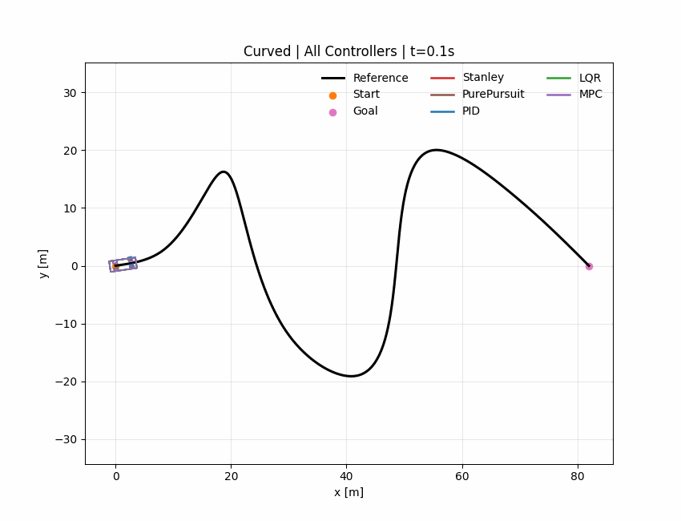
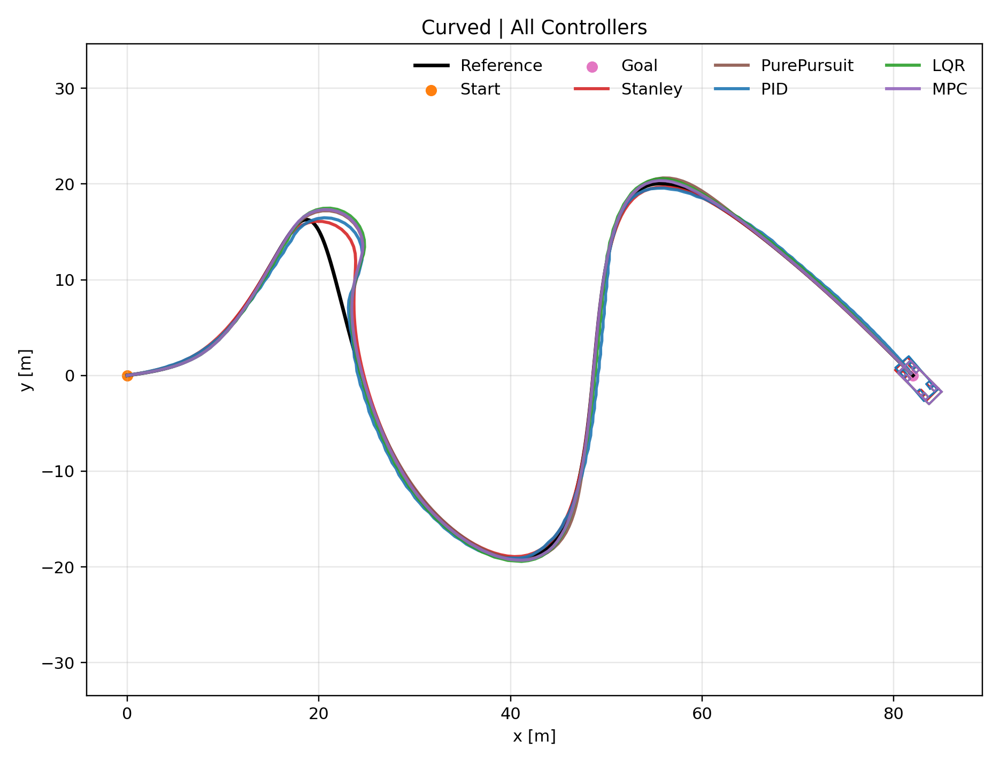
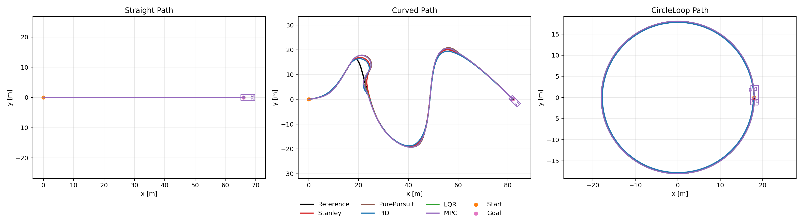
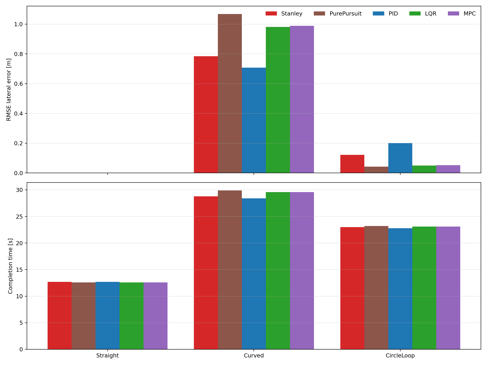

# Path Tracking Controllers Benchmark

Comparative benchmark and visualization project for representative vehicle path-tracking controllers in Python.

这是一个面向自动驾驶控制/规控岗位展示的轨迹跟踪 benchmark 项目。项目把几何法、经典反馈控制和模型控制方法统一到同一套车辆模型与仿真评测框架里，支持：

- 多控制器同图联跑演示
- 每个场景的 GIF 动画展示
- 统一结果表与指标图导出
- 跟踪误差、完成时间、速度误差和控制平滑性量化评测

## At a Glance

- `5` 个已接入控制器，覆盖 `3` 类主流路径跟踪思路
- `3` 个典型任务：`Straight / Curved / CircleLoop`
- 所有控制器在同一张图中使用不同颜色叠加展示
- 支持实时弹窗、GIF 导出和同图联跑演示
- 统一输出到 `outputs/`，README 展示素材固定放在 `assets/readme/`
- 仓库目录结构与 `path-planning-algorithms` 保持一致，便于成套展示

## Control Methods Landscape

轨迹跟踪控制方法通常可以粗分为以下几类：

- `Geometric controllers`
  - `Pure Pursuit`
  - `Stanley`
- `Classical feedback controllers`
  - `PID`
  - `LQR`
- `Model-based controllers`
  - `MPC`

## Implemented in This Repo

| Category | Method | Role in This Benchmark |
| --- | --- | --- |
| Geometric | `Stanley` | 基于航向误差和横向误差的经典几何跟踪方法 |
| Geometric | `Pure Pursuit` | 基于前视点的几何路径跟踪方法 |
| Classical feedback | `PID` | 速度 PID + 横向误差反馈的工程基线方法 |
| Classical feedback | `LQR` | 基于线性二次型调节器的状态反馈控制 |
| Model-based | `MPC` | 基于有限时域模型预测的优化控制器 |

## Benchmark Fairness Note

这个项目里不同控制器的理论假设并不完全一致，所以 README 里把评测设定说明清楚很重要：

- 所有方法都运行在统一的运动学自行车模型上。
- 所有场景共享统一参考轨迹、统一仿真时钟、统一终点判定和统一指标统计。
- 当前框架还加入了曲率感知速度规划、转向角速率限制和一阶执行器动态，使对比更接近真实执行器约束。

这样做的目的，是把几何法、经典反馈法和模型控制法放进统一框架里展示“跟踪精度、稳定性、平滑性和时间代价”的 trade-off，而不是简单比较谁在某一项指标上绝对最优。

## Scenarios

| Scenario | Description |
| --- | --- |
| `Straight` | 直线路径，主要验证基础速度控制与稳态跟踪能力 |
| `Curved` | 高曲率、多转折连续曲线，考察横向误差抑制与控制稳定性 |
| `CircleLoop` | 完整闭环一圈任务，考察持续曲率场景下的闭环鲁棒性 |

## Visualization

### Curved Live Demo



### Curved Multi-controller Snapshot



### Trajectory Overview



### Metric Dashboard



## Experiment Highlights

### 1. Overall

- `Straight` 任务区分度较低，更适合作为基础正确性验证。
- `Curved` 是当前最有挑战性的场景，最能拉开不同方法在误差和控制平滑性上的差异。
- `CircleLoop` 更适合观察持续曲率条件下的闭环稳定能力。

### 2. By Scenario

- `Straight`：5 种控制器都能稳定完成近零误差跟踪，说明统一建模、路径索引和控制接口已经正确闭环。
- `Curved`：`PID` 在当前参数下取得了最低 RMSE，但转向变化率最高；`LQR` 和 `MPC` 虽然误差略大，但控制输入更平滑，体现了精度与平滑性的典型 trade-off。
- `CircleLoop`：`Pure Pursuit` 的 RMSE 最低，说明前视策略在闭环连续曲率任务里非常有效；`MPC`、`LQR` 和 `Stanley` 也保持了较低误差和较稳的闭环表现。

### 3. By Controller

- `Stanley`：在几何路径跟踪任务中整体表现稳定，适合曲率变化明显的路径。
- `Pure Pursuit`：实现简单、效果直观，在闭环和持续曲率任务里很有代表性。
- `PID`：适合作为 baseline，在高曲率任务里可以通过调参取得较低误差，但通常会伴随更激进的转向变化。
- `LQR`：具备较强的经典控制解释性，适合做状态反馈方法对照。
- `MPC`：虽然 RMSE 不一定始终最低，但通常能在精度和控制平滑性之间取得更稳妥的平衡。

## Benchmark Results

完整结果会在本地运行后输出到 `outputs/benchmark_results.csv` 和 `outputs/benchmark_results.md`。

当前版本的一些代表性结果：

- `Straight`
  - 5 种控制器均可实现近零误差跟踪
- `Curved`
  - Lowest RMSE: `PID = 0.707 m`
  - Lower steering rate among robust methods: `Stanley = 0.163 rad/s`, `MPC = 0.203 rad/s`
- `CircleLoop`
  - Lowest RMSE: `Pure Pursuit = 0.042 m`
  - `MPC / LQR / Stanley` 也维持了较低误差与较稳闭环表现

## Current Benchmark Snapshot

| Scenario | Controller | Success | Avg Lat Err (m) | Max Lat Err (m) | RMSE (m) | Completion Time (s) | Mean \|Speed Err\| (m/s) | Mean \|Steer\| (rad) | Mean \|Steer Rate\| (rad/s) |
| --- | --- | --- | ---: | ---: | ---: | ---: | ---: | ---: | ---: |
| Straight | Stanley | Yes | 0.000 | 0.000 | 0.000 | 12.70 | 0.985 | 0.000 | 0.000 |
| Straight | PurePursuit | Yes | 0.000 | 0.000 | 0.000 | 12.60 | 0.981 | 0.000 | 0.000 |
| Straight | PID | Yes | 0.000 | 0.000 | 0.000 | 12.70 | 0.989 | 0.000 | 0.000 |
| Straight | LQR | Yes | 0.000 | 0.000 | 0.000 | 12.60 | 0.985 | 0.000 | 0.000 |
| Straight | MPC | Yes | 0.000 | 0.000 | 0.000 | 12.60 | 0.985 | 0.000 | 0.000 |
| Curved | Stanley | Yes | 0.310 | 3.673 | 0.784 | 28.80 | 0.713 | 0.154 | 0.163 |
| Curved | PurePursuit | Yes | 0.387 | 4.630 | 1.067 | 29.90 | 0.748 | 0.163 | 0.180 |
| Curved | PID | Yes | 0.354 | 3.302 | 0.707 | 28.40 | 0.698 | 0.170 | 0.320 |
| Curved | LQR | Yes | 0.338 | 4.413 | 0.980 | 29.60 | 0.722 | 0.163 | 0.217 |
| Curved | MPC | Yes | 0.346 | 4.432 | 0.988 | 29.60 | 0.722 | 0.162 | 0.203 |
| CircleLoop | Stanley | Yes | 0.118 | 0.148 | 0.121 | 23.00 | 0.269 | 0.158 | 0.066 |
| CircleLoop | PurePursuit | Yes | 0.039 | 0.071 | 0.042 | 23.20 | 0.267 | 0.148 | 0.023 |
| CircleLoop | PID | Yes | 0.195 | 0.222 | 0.201 | 22.80 | 0.274 | 0.161 | 0.615 |
| CircleLoop | LQR | Yes | 0.047 | 0.066 | 0.050 | 23.10 | 0.271 | 0.148 | 0.256 |
| CircleLoop | MPC | Yes | 0.049 | 0.068 | 0.052 | 23.10 | 0.270 | 0.148 | 0.157 |

## Quick Start

### 1. Install

```bash
pip install -r requirements.txt
```

### 2. Run the benchmark

```bash
python Compare_controller.py
```

默认会执行：

- 实时弹出综合演示窗口
- 同一张图里显示多个控制器一起跑
- 覆盖旧结果并重新生成图表

### 3. Silent run

```bash
python Compare_controller.py --no-live
```

### 4. Export GIFs

```bash
python Compare_controller.py --animate
```

会额外生成：

- `outputs/animations/`
- `outputs/comparison_effects/animations/`

## Run Individual Controllers

每个控制器都可以独立运行：

```bash
python Stanley.py
python PurePursuit.py
python PID.py
python LQR.py
python MPC.py
```

如果只生成结果，不弹实时窗口：

```bash
python Stanley.py --no-live
python PurePursuit.py --no-live
python PID.py --no-live
python LQR.py --no-live
python MPC.py --no-live
```

## File Guide

| File | Purpose |
| --- | --- |
| `Compare_controller.py` | 控制 benchmark 薄入口，和规划仓库的入口形式保持一致 |
| `benchmark_runner.py` | 统一调度控制器、导出图表、动画和联跑效果的核心运行器 |
| `common.py` | 公共数据结构、车辆模型、PID 工具和仿真配置定义 |
| `Stanley.py` | `Stanley` 控制器实现与独立运行入口 |
| `PurePursuit.py` | `Pure Pursuit` 控制器实现与独立运行入口 |
| `PID.py` | `PID` 基线控制器实现与独立运行入口 |
| `LQR.py` | `LQR` 路径跟踪控制器实现与独立运行入口 |
| `MPC.py` | `MPC` 控制器实现与独立运行入口 |
| `cubic_spline.py` | 样条路径生成模块，用于构造参考轨迹 |
| `draw.py` | 小车可视化绘制工具，用于静态图和动画展示 |
| `assets/readme/` | README 展示图片与 GIF |
| `outputs/` | benchmark 本地运行输出目录，默认不纳入 GitHub 展示结构 |

## Resume-oriented Summary

> 搭建了一个覆盖几何法、经典反馈法和模型控制法三类思路的轨迹跟踪 benchmark 项目，统一实现并评测 Stanley、Pure Pursuit、PID、LQR、MPC 共 5 类控制器，在直线、高曲率曲线和整圈闭环任务上对横向误差、完成时间、速度误差和控制平滑性进行量化对比，并完成实时演示、GIF 动态展示和图表自动生成。

## Notes

- README 中使用的展示图片位于 `assets/readme/`，适合直接同步到 GitHub 首页展示。
- `outputs/` 是本地运行产物，每次 benchmark 会自动覆盖旧结果。
- 如果在 PyCharm 中运行但没有弹出独立窗口，通常是因为开启了 SciView；关闭 `Show plots in tool window` 后再运行即可。

## License

This project is released under the MIT License. See `LICENSE` for details.
